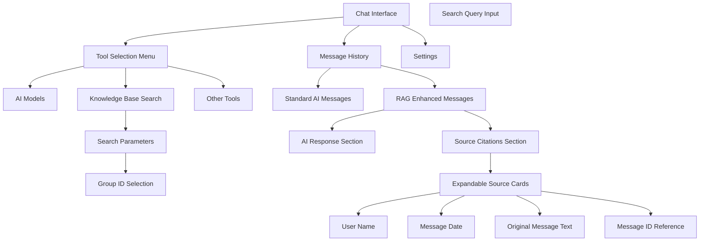
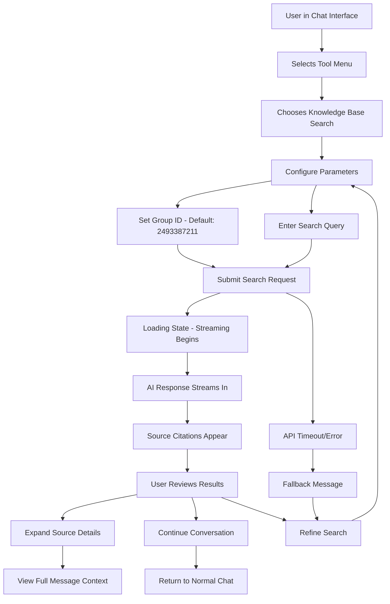
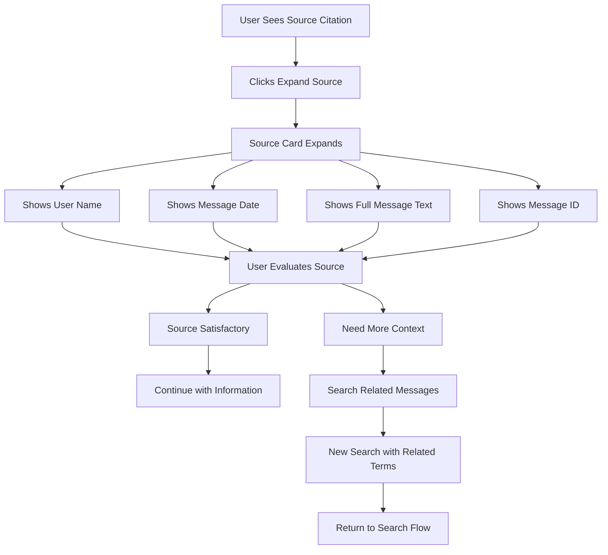

# Guru Chat Bot UI/UX Specification

## Introduction

This document defines the user experience goals, information architecture, user flows, and visual design specifications for **Guru Chat Bot**'s user interface. It serves as the foundation for visual design and frontend development, ensuring a cohesive and user-centered experience.

The focus of this specification is the integration of an external RAG knowledge base tool that enables users to search Telegram message history and receive contextual responses with full source attribution, while maintaining seamless integration with the existing AI streaming architecture.

**Key Design Context:**
- **Existing Architecture**: Next.js 15 with experimental PPR, Vercel AI SDK v5, real-time streaming
- **Integration Approach**: Adding RAG tool to existing tool selection system
- **User Experience Goal**: Maintain existing chat experience while adding powerful knowledge search capabilities
- **Technical Constraint**: Must work within existing shadcn/ui component library and streaming architecture

### Overall UX Goals & Principles

#### Target User Personas

**Power User:** Technical professionals who need advanced search capabilities to quickly locate specific information from extensive Telegram message histories. They value efficiency and comprehensive results with detailed source attribution.

**Knowledge Worker:** Team members and collaborators who need to reference past discussions, decisions, and shared knowledge. They prioritize accuracy and context when retrieving historical information.

**Casual User:** Occasional users who need to find specific information but prefer simple, guided interactions. They value clear guidance and immediate, relevant results without complex configuration.

#### Usability Goals

- **Seamless Integration:** Users can access knowledge base search without disrupting their existing chat workflow - it feels like a natural extension of the AI conversation
- **Fast Discovery:** Users can locate relevant historical information within 30 seconds of initiating a search
- **Source Trust:** Users can verify and explore original context through clear, accessible source citations
- **Cognitive Clarity:** The distinction between AI-generated responses and historical source material is immediately apparent

#### Design Principles

1. **Continuity over Novelty** - Leverage existing chat patterns and tool selection UX to minimize learning curve
2. **Sources as Evidence** - Present source citations as supporting evidence, not competing content
3. **Progressive Disclosure** - Show essential information first, with source details available on demand
4. **Context Preservation** - Maintain chat flow and conversation context throughout knowledge base interactions
5. **Trust through Transparency** - Make the source and nature of information immediately clear to users

### Change Log

| Date | Version | Description | Author |
|------|---------|-------------|--------|
| 2025-09-14 | 1.0 | Initial UI/UX Specification | Sally (UX Expert) |

## Information Architecture (IA)

### Site Map / Screen Inventory

### Navigation Structure

**Primary Navigation:** The existing chat interface remains the primary navigation hub, with tool selection accessible through the established tool selection pattern (likely a dropdown, button array, or sidebar depending on current implementation).

**Secondary Navigation:** Within RAG tool results, users navigate between AI response and source citations through visual scanning and optional expansion/collapse of source details. No additional navigation chrome is required.

**Breadcrumb Strategy:** No traditional breadcrumbs needed. Context is maintained through conversation history and clear visual distinction between tool-generated content and standard chat responses.

## User Flows

### Knowledge Base Search Flow

**User Goal:** Find specific information from Telegram message history and understand its original context

**Entry Points:**
- Tool selection menu in active chat conversation
- Direct tool invocation through chat interface

**Success Criteria:** User receives relevant information with clear source attribution and can verify original context

#### Flow Diagram

#### Edge Cases & Error Handling:

- External API unavailable: Display fallback message with option to retry
- No search results found: Suggest alternative search terms or broader parameters
- Malformed search parameters: Provide inline validation and correction guidance
- Network timeout: Implement progressive timeout with user feedback
- Streaming interruption: Graceful degradation to static response format

### Context Verification Flow

**User Goal:** Verify and explore the original context of cited information

**Entry Points:**
- Clicking/tapping source citation within RAG response
- Expanding collapsed source details

**Success Criteria:** User can access full message context and understand the source's relevance

#### Flow Diagram

#### Edge Cases & Error Handling:

- Source text truncation: Indicate when message text is shortened with expansion option
- Missing metadata: Handle cases where user_name, date, or msg_id are unavailable
- Source relevance unclear: Provide context on why this source was selected

## Wireframes & Mockups

**Primary Design Files:** Recommend creating detailed mockups in Figma or similar design tool to visualize the RAG tool integration within the existing chat interface. Focus on responsive layouts and component states.

### Key Screen Layouts

#### Knowledge Base Tool Selection

**Purpose:** Allow users to select and configure the RAG search tool within the existing tool selection interface

**Key Elements:**
- Tool icon and name ("Knowledge Base Search" or "Search History")
- Brief description text: "Search Telegram message history with source citations"
- Configuration trigger button/area

**Interaction Notes:** Should follow existing tool selection patterns. If current tools use a dropdown, cards, or sidebar approach, maintain that pattern for consistency.

**Design File Reference:** Create frame showing tool selection UI with RAG option highlighted

#### RAG Response Message Layout

**Purpose:** Display AI-generated response alongside source citations in the chat message stream

**Key Elements:**
- Primary AI response text (streams in like standard messages)
- Visual separator between AI content and sources
- Collapsible source citation section with count indicator (e.g., "3 sources")
- Source preview cards showing user name and date

**Interaction Notes:** Sources should be collapsed by default to avoid overwhelming the response. Expansion should be smooth and maintain message positioning. Consider loading states during streaming.

**Design File Reference:** Create frames showing collapsed and expanded states, plus streaming animation states

#### Expanded Source Citation Card

**Purpose:** Show full context and metadata for individual message sources

**Key Elements:**
- User name with visual emphasis (avatar if available)
- Formatted message date (relative time + absolute timestamp)
- Full message text with proper typography
- Message ID for reference
- Visual indicators for source relevance/confidence

**Interaction Notes:** Should feel like expanding a message thread. Consider highlighting search term matches within the source text. Include subtle visual connection to the search that generated this result.

**Design File Reference:** Create detailed component showing all metadata fields and responsive behavior

## Component Library / Design System

**Design System Approach:** Leverage existing shadcn/ui components as the foundation, extending with custom components only where necessary for RAG-specific functionality. This maintains visual consistency and development efficiency.

### Core Components

#### RAG Tool Selector

**Purpose:** Integration component for tool selection interface that presents the Knowledge Base Search option

**Variants:**
- Default state (unselected)
- Selected/active state
- Disabled state (when external API unavailable)

**States:** Default, hover, active, disabled, loading

**Usage Guidelines:** Must integrate seamlessly with existing tool selection pattern. Use consistent icons and description format matching other tools.

#### RAG Response Container

**Purpose:** Wrapper component that structures AI response and source citations as a cohesive message unit

**Variants:**
- Streaming (content appearing progressively)
- Complete (all content loaded)
- Error state (API failure or timeout)

**States:** Loading, streaming, complete, error, retry

**Usage Guidelines:** Maintains existing message styling while providing structure for dual content types (AI response + sources). Should feel like a natural extension of current message components.

#### Source Citation Card

**Purpose:** Expandable component displaying individual message source information

**Variants:**
- Collapsed (preview with user name and date)
- Expanded (full message text and metadata)
- Highlighted (when search terms match within source)

**States:** Collapsed, expanded, loading, error

**Usage Guidelines:** Should feel familiar to users accustomed to expandable content. Visual hierarchy must clearly distinguish between different metadata types (user, date, content, ID).

#### Search Parameter Form

**Purpose:** Input component for configuring RAG search parameters

**Variants:**
- Simple (query only, uses defaults)
- Advanced (query + group ID customization)

**States:** Default, focused, validating, error, submitted

**Usage Guidelines:** Default to simple variant for casual users. Advanced controls should be progressively disclosed. Must integrate with existing form styling patterns.

## Branding & Style Guide

### Visual Identity

**Brand Guidelines:** Inherit from existing Guru Chat Bot visual identity and maintain consistency with current design system.

### Color Palette

| Color Type | Hex Code | Usage |
|------------|----------|-------|
| Primary | Inherit from existing | Tool selection, primary actions |
| Secondary | Inherit from existing | Secondary UI elements |
| Accent | Inherit from existing | Highlights, active states |
| Success | #10B981 | Successful RAG responses, confirmation states |
| Warning | #F59E0B | External API delays, parameter validation |
| Error | #EF4444 | API failures, search errors |
| Source Highlight | #3B82F6 | Source citation emphasis, expandable content |
| Source Background | #F8FAFC | Citation card backgrounds |
| Neutral | Inherit from existing | Text, borders, backgrounds |

### Typography

#### Font Families
- **Primary:** Inherit from existing system
- **Secondary:** Inherit from existing system
- **Monospace:** Used for message IDs and technical references

#### Type Scale
| Element | Size | Weight | Line Height |
|---------|------|---------|------------|
| Source User Name | 14px | 600 | 1.4 |
| Source Date | 12px | 400 | 1.3 |
| Source Content | 14px | 400 | 1.5 |
| Message ID | 11px | 400 | 1.2 |
| Citation Count | 13px | 500 | 1.4 |

### Iconography

**Icon Library:** Leverage existing icon system (likely Lucide React based on shadcn/ui usage)

**Usage Guidelines:**
- Search/Knowledge icon for tool selection
- Expand/collapse icons for source citations
- External link icon for source references
- Clock icon for message timestamps

### Spacing & Layout

**Grid System:** Maintain existing responsive grid system

**Spacing Scale:** Use existing spacing tokens, with specific attention to:
- Citation card padding: 16px internal spacing
- Source separator margins: 12px vertical spacing
- Expandable content transitions: 8px padding adjustments

## Accessibility Requirements

### Compliance Target

**Standard:** WCAG 2.1 Level AA compliance, maintaining consistency with existing chatbot accessibility standards

### Key Requirements

**Visual:**
- Color contrast ratios: 4.5:1 minimum for source text and citations, 3:1 for large text elements
- Focus indicators: Visible focus rings on all interactive elements including expandable source cards
- Text sizing: Source citations must be readable at 200% zoom without horizontal scrolling

**Interaction:**
- Keyboard navigation: Tab order flows logically through RAG responses (AI content → source expand/collapse → individual sources)
- Screen reader support: Proper ARIA labels for source citations, expandable regions announced as "collapsed/expanded"
- Touch targets: Minimum 44px touch targets for source expansion controls on mobile devices

**Content:**
- Alternative text: Icons in source citations require descriptive alt text ("Expand source details", "Message from [user]")
- Heading structure: Source sections use appropriate heading levels within message hierarchy
- Form labels: Search parameter inputs have clear, programmatically associated labels

### Testing Strategy

**Automated Testing:** Integrate accessibility linting with existing build process to catch ARIA and semantic HTML issues

**Manual Testing:** Test source citation expansion/collapse with screen readers (NVDA, JAWS, VoiceOver) and keyboard-only navigation

**User Testing:** Include users with disabilities in testing RAG response comprehension and source verification workflows

## Responsiveness Strategy

### Breakpoints

| Breakpoint | Min Width | Max Width | Target Devices |
|------------|-----------|-----------|----------------|
| Mobile | 320px | 767px | Smartphones, small tablets |
| Tablet | 768px | 1023px | Tablets, small laptops |
| Desktop | 1024px | 1439px | Laptops, desktop monitors |
| Wide | 1440px | - | Large monitors, ultrawide displays |

### Adaptation Patterns

**Layout Changes:**
- Mobile: Source citations stack vertically with full-width cards, single column layout for all message content
- Tablet: Source citations remain stacked but with improved padding and spacing
- Desktop: Consider side-by-side layout for AI response and sources when space permits
- Wide: Maintain conversation-focused layout, avoid excessive line lengths

**Navigation Changes:**
- Mobile: Touch-friendly expansion controls for source citations, increased tap target sizes
- Tablet: Hybrid touch/cursor interactions, maintain generous spacing
- Desktop: Hover states for source preview, keyboard shortcuts for expansion
- Wide: No additional navigation complexity

**Content Priority:**
- Mobile: AI response shown first, sources collapsed by default with clear expand indicator
- Tablet: Sources preview visible (user name + date) before expansion
- Desktop: More source metadata visible in collapsed state
- Wide: Full context available without overwhelming the interface

**Interaction Changes:**
- Mobile: Swipe gestures considered for source navigation, touch-optimized controls
- Tablet: Touch and cursor hybrid interactions
- Desktop: Keyboard shortcuts, hover previews
- Wide: Maintain simplicity, avoid over-engineering interactions

## Animation & Micro-interactions

### Motion Principles

**Continuity with Existing:** Maintain consistency with current streaming animation patterns and message appearance behaviors

**Progressive Enhancement:** Animations should enhance comprehension without being essential for functionality

**Performance Conscious:** Respect user motion preferences and device capabilities, especially on mobile

**Purposeful Motion:** Every animation should serve a functional purpose - indicating state changes, providing feedback, or guiding attention

### Key Animations

- **RAG Response Streaming:** Inherit existing message streaming animation, with subtle visual cue when transitioning from AI content to source citations (Duration: Inherited, Easing: ease-out)

- **Source Section Reveal:** Gentle fade-in of source citation section after AI response completes (Duration: 200ms, Easing: ease-out)

- **Citation Card Expansion:** Smooth height transition when expanding source details, with content fade-in (Duration: 300ms, Easing: cubic-bezier(0.4, 0, 0.2, 1))

- **Tool Selection Feedback:** Brief highlight or scale animation on RAG tool selection to confirm choice (Duration: 150ms, Easing: ease-out)

- **Loading States:** Subtle pulse animation for search parameter form during API request (Duration: 1.2s, Easing: ease-in-out, infinite)

- **Error State Transitions:** Gentle shake animation for failed searches with color transition to error state (Duration: 400ms, Easing: ease-out)

- **Citation Count Badge:** Subtle bounce animation when source count appears (Duration: 200ms, Easing: cubic-bezier(0.68, -0.55, 0.265, 1.55))

## Performance Considerations

### Performance Goals

- **Page Load:** Maintain existing chat interface load times, RAG components should not impact initial page performance
- **Interaction Response:** Tool selection and parameter configuration should respond within 100ms
- **Animation FPS:** Maintain 60fps for source citation expansion animations, degrade gracefully on lower-end devices

### Design Strategies

**Lazy Loading:** Source citation components only load when RAG tool is first used, reducing initial bundle size

**Progressive Enhancement:** RAG functionality layers on top of existing chat without blocking core features

**Efficient State Management:** Citation expansion state managed locally to avoid unnecessary re-renders of message history

**API Response Optimization:**
- Implement request deduplication for identical search queries within session
- Consider caching recent search results client-side for improved perceived performance
- Stream source citations progressively as they become available from API

**Memory Management:**
- Limit number of expanded citation cards simultaneously (e.g., collapse others when expanding new ones)
- Implement virtual scrolling for messages with large numbers of sources
- Clean up animation references and event listeners on component unmount

**Bundle Size Considerations:**
- RAG-specific components code-split from main chat bundle
- Use existing shadcn/ui components to avoid duplication
- Minimize external dependencies for citation rendering

## Next Steps

### Immediate Actions

1. **Stakeholder Review** - Present this UI/UX specification to product and development teams for feedback and alignment
2. **Create Detailed Mockups** - Develop high-fidelity designs in Figma showing RAG tool integration within existing chat interface
3. **Prototype Key Interactions** - Build interactive prototypes for source citation expansion and tool selection flows
4. **Validate Information Architecture** - Test proposed user flows with representative users to ensure comprehension
5. **Technical Feasibility Review** - Work with development team to confirm design approaches align with Vercel AI SDK v5 capabilities

### Design Handoff Checklist

- [x] All user flows documented
- [x] Component inventory complete
- [x] Accessibility requirements defined
- [x] Responsive strategy clear
- [x] Brand guidelines incorporated
- [x] Performance goals established
- [ ] High-fidelity mockups created
- [ ] Interactive prototypes built
- [ ] Developer handoff documentation prepared
- [ ] Component specifications detailed
- [ ] Animation specifications documented
- [ ] Error state designs completed